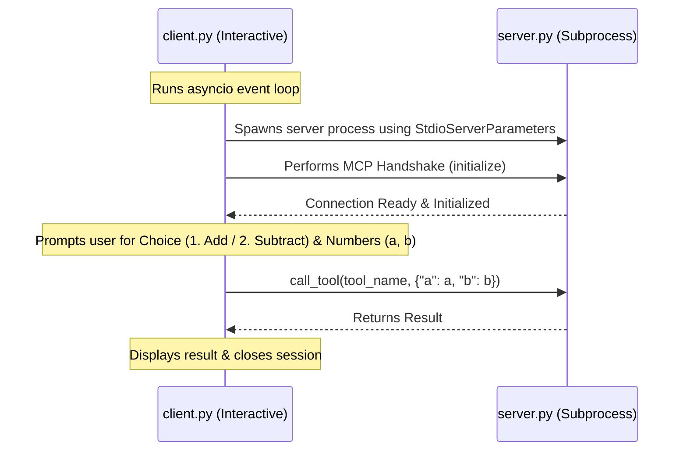

# Model Context Protocol (MCP) Client & Server Demo

A lightweight demonstration of the **Model Context Protocol (MCP)**, featuring an MCP Server built with `FastMCP` and an interactive, asynchronous Python MCP Client that communicates via the `stdio` transport.

---

## 📌 Purpose & Overview

This project showcases how to build, invoke, and consume an MCP server. 

- **Automatic Invocation**: You don't need to start the server and client separately. When you run `client.py`, it automatically spawns the server as a subprocess, establishes a stdio-based session handshake, and provides an interactive command-line interface.
- **Interactive Interface**: The client prompts the user to select an arithmetic operation (addition or subtraction) and input two numbers, then calls the corresponding tool on the server and displays the result.

---

## 🏗️ Architecture



---

## 📂 Project Structure

* **`server.py`**: Declares the MCP Server instance using `FastMCP` and registers tool functions (`add` and `subtract`).
* **`client.py`**: Launches the server using `stdio_client`, establishes the `ClientSession` handshake, presents a menu to the user, and invokes the chosen tool.
* **`mcp_env/`**: Python virtual environment containing the necessary packages.

---

## 🚀 How to Use

### 1. Activate the Virtual Environment

Ensure you are in the project root directory, then activate the python virtual environment:

```bash
# On macOS / Linux:
source mcp_env/bin/activate
```

*(If you are setting this up from scratch, install dependencies using `pip install mcp`)*

### 2. Run the Client

Execute the client script. The client will automatically invoke the server and prompt you for inputs:

```bash
python client.py
```

### 3. Example Interactive Flow

```text
Choose Tool
1. Add
2. Subtract
Enter choice: 1
Enter first number: 34
Enter second number: 21

Result: 55
```

> [!WARNING]
> In `client.py`, selecting option `2` (Subtract) currently calls the tool named `"sub"`. However, in `server.py`, the tool is registered under the function name `"subtract"`. For option `2` to work successfully, the tool name in `client.py` should match the one in `server.py`.